# Packer & Terraform — Custom AMI + AWS Infrastructure

Build a custom Amazon Linux AMI with Docker and Prometheus Node Exporter pre-installed using **Packer**, then provision a full AWS VPC with a bastion host, 6 private EC2 instances, and 1 private monitoring EC2 (Prometheus + Grafana) using **Terraform**.

## Table of Contents

- [Architecture](#architecture)
- [Prerequisites](#prerequisites)
- [Project Structure](#project-structure)
- [Part A — Build the Custom AMI with Packer](#part-a--build-the-custom-ami-with-packer)
- [Part B — Provision Infrastructure with Terraform](#part-b--provision-infrastructure-with-terraform)
- [Part C — Verify Connectivity](#part-c--verify-connectivity)
- [Part D — Verify Monitoring (Prometheus + Grafana)](#part-d--verify-monitoring-prometheus--grafana)
- [What to Expect](#what-to-expect)
- [Cleanup](#cleanup)

---

## Architecture

```
                    Internet
                       │
                  ┌────┴────┐
                  │   IGW    │
                  └────┬────┘
                       │
          ┌────────────┴────────────┐
          │         VPC             │
          │      10.0.0.0/16        │
          │                         │
          │  ┌─────────────────┐    │
          │  │  Public Subnets │    │
          │  │  10.0.1.0/24    │    │
          │  │  10.0.2.0/24    │    │
          │  │                 │    │
          │  │  ┌───────────┐  │    │
          │  │  │  Bastion  │  │    │
          │  │  │  (SSH:22) │  │    │
          │  │  └─────┬─────┘  │    │
          │  │        │        │    │
          │  │  ┌─────┴─────┐  │    │
          │  │  │  NAT GW   │  │    │
          │  │  └─────┬─────┘  │    │
          │  └────────┼────────┘    │
          │           │             │
          │  ┌────────┴────────┐    │
          │  │ Private Subnets │    │
          │  │ 10.0.10.0/24   │    │
          │  │ 10.0.20.0/24   │    │
          │  │                 │    │
          │  │  ┌───┐ ┌───┐   │    │
          │  │  │EC2│ │EC2│   │    │
          │  │  └───┘ └───┘   │    │
          │  │  ┌───┐ ┌───┐   │    │
          │  │  │EC2│ │EC2│   │    │
          │  │  └───┘ └───┘   │    │
          │  │  ┌───┐ ┌───┐   │    │
          │  │  │EC2│ │EC2│   │    │
          │  │  └───┘ └───┘   │    │
          │  └─────────────────┘    │
          └─────────────────────────┘
```

**How traffic flows:**

- **You** SSH into the **bastion host** (public subnet) — only your IP is allowed on port 22.
- From the bastion, you SSH into any of the **6 private instances** — they only accept SSH from the bastion's security group.
- Private instances reach the internet (for `yum update`, Docker pulls, etc.) through the **NAT Gateway** in the public subnet.

---

## Prerequisites

Before starting, make sure you have the following tools installed:

- [Packer](https://developer.hashicorp.com/packer/install) >= 1.9
- [Terraform](https://developer.hashicorp.com/terraform/install) >= 1.5
- [AWS CLI v2](https://docs.aws.amazon.com/cli/latest/userguide/getting-started-install.html) configured with credentials (`aws configure`)
- An AWS key pair in your target region (or you'll create one in Step 1)

Verify your installations:

```bash
packer version
terraform version
aws configure
```

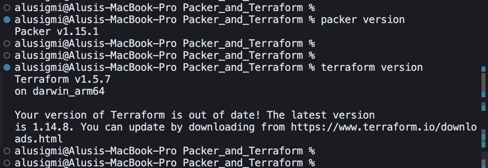

---

## Project Structure

```
Packer_and_Terraform/
├── packer/
│   ├── amazon-linux-docker.pkr.hcl      # Packer template (AMI definition)
│   └── variables.pkrvars.hcl.example    # Example variables (copy and fill in)
├── terraform/
│   ├── main.tf                          # Root module — wires all modules together
│   ├── monitoring.tf                    # Monitoring EC2 in private subnet (Prometheus + Grafana)
│   ├── variables.tf                     # Input variable declarations
│   ├── outputs.tf                       # Output values (bastion IP, private IPs, etc.)
│   ├── terraform.tfvars.example         # Example variable values (copy and fill in)
│   └── modules/
│       ├── vpc/                         # VPC, subnets, IGW, NAT Gateway, route tables
│       ├── security-groups/             # Bastion SG (your IP only) + Private SG (bastion only)
│       ├── bastion/                     # 1 bastion host in the public subnet
│       └── private-instances/           # 6 EC2 instances spread across private subnets
├── images/                              # Screenshots for documentation
├── .gitignore
└── README.md
```

### Terraform Modules

| Module | Resources Created |
|--------|-------------------|
| `vpc` | VPC, 2 public subnets, 2 private subnets, Internet Gateway, NAT Gateway, Elastic IP, public + private route tables, route table associations |
| `security-groups` | Bastion SG (ingress SSH from your IP only), Private SG (ingress SSH from bastion SG only) |
| `bastion` | 1 EC2 instance in the first public subnet with a public IP |
| `private-instances` | 6 EC2 instances distributed round-robin across private subnets |

---

## Part A — Build the Custom AMI with Packer

The Packer template creates an AMI based on **Amazon Linux 2023** with the following baked in:

- Docker (enabled and started on boot)
- Docker Compose v2.24.0
- Prometheus Node Exporter (enabled and started on boot, port `9100`)
- Your SSH public key in `~/.ssh/authorized_keys`

### Step 1 — Create or locate an AWS Key Pair

You need a key pair in your target region (`us-west-2`) so Terraform can assign it to instances later. If you don't have one:

```bash
aws ec2 create-key-pair \
  --key-name packer-tf-key \
  --region us-west-2 \
  --query 'KeyMaterial' \
  --output text > ~/.ssh/packer-tf-key.pem

chmod 600 ~/.ssh/packer-tf-key.pem
```

### Step 2 — Get your SSH public key

This key gets baked into the AMI so you can log in without specifying a key pair file:

```bash
cat ~/.ssh/id_rsa.pub
# or if you use ed25519:
cat ~/.ssh/id_ed25519.pub
```

> **Note:** If you don't have an SSH key pair yet, generate one with `ssh-keygen -t ed25519`.

### Step 3 — Configure Packer variables

```bash
cd packer
cp variables.pkrvars.hcl.example variables.pkrvars.hcl
```

Edit `variables.pkrvars.hcl` and paste your actual public key:

```hcl
aws_region     = "us-west-2"
ssh_public_key = "ssh-ed25519 AAAAC3Nza... your-email@example.com"
instance_type  = "t3.micro"
```

### Step 4 — Initialize, validate, and build

```bash
packer init amazon-linux-docker.pkr.hcl
packer validate -var-file=variables.pkrvars.hcl amazon-linux-docker.pkr.hcl
packer build -var-file=variables.pkrvars.hcl amazon-linux-docker.pkr.hcl
```

`packer init` downloads the Amazon plugin. `packer validate` confirms the template is valid. `packer build` launches a temporary EC2 instance, runs the provisioning steps (install Docker, add your SSH key), creates the AMI, then terminates the temporary instance.

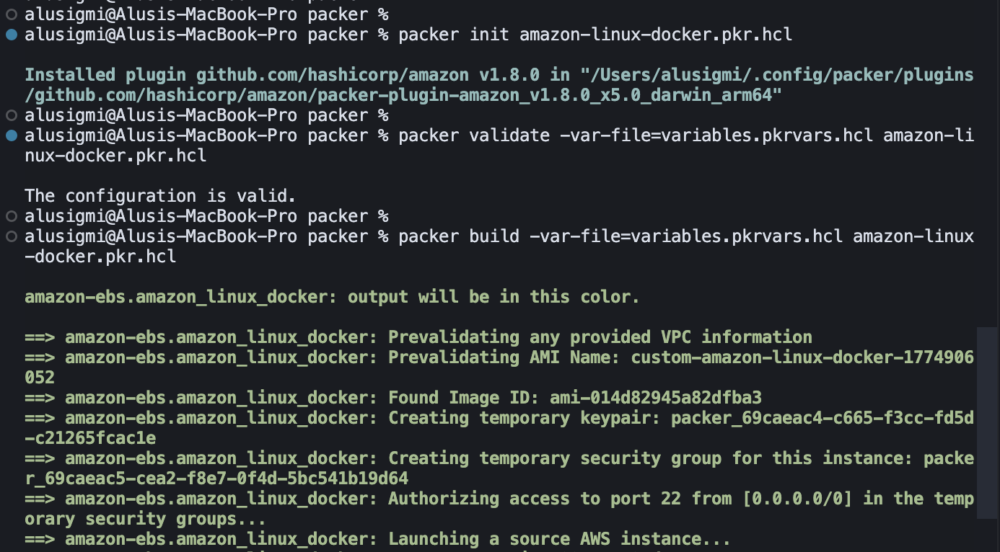

The build takes approximately **7-8 minutes**. When it finishes, you'll see the new AMI ID:

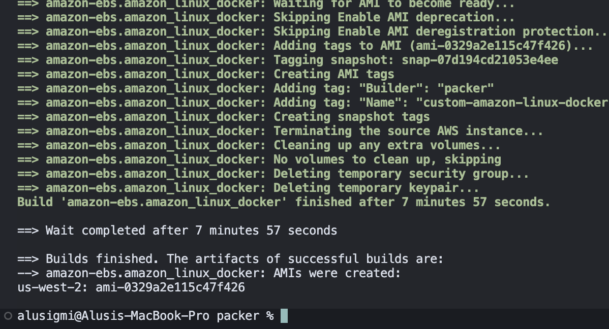

**Copy the AMI ID** (e.g. `ami-0329a2e115c47f426`) — you'll need it for Terraform in the next part.

You can verify the AMI was created in the AWS Console under **EC2 > AMIs** (filter by "Owned by me"):

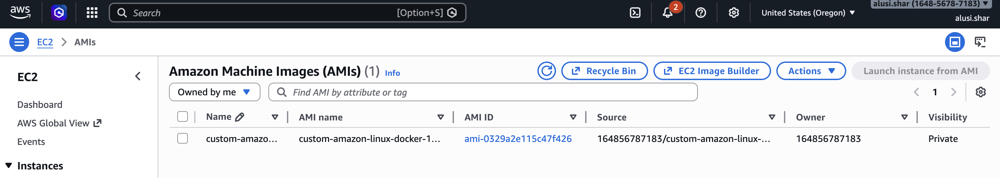

---

## Part B — Provision Infrastructure with Terraform

### Step 1 — Get your public IP

The bastion's security group restricts SSH access to only your IP address:

```bash
curl -s ifconfig.me
```

Note the output (e.g. `98.42.173.55`) — you'll use it as `98.42.173.55/32`.

### Step 2 — Configure Terraform variables

```bash
cd ../terraform
cp terraform.tfvars.example terraform.tfvars
```

Edit `terraform.tfvars` with your actual values:

```hcl
aws_region   = "us-west-2"
project_name = "packer-tf-lab"
ami_id       = "ami-0329a2e115c47f426"   # AMI ID from Packer build output
key_name     = "packer-tf-key"           # Your AWS key pair name
my_ip_cidr   = "98.42.173.55/32"         # Your public IP from curl ifconfig.me
```

### Step 3 — Initialize Terraform

```bash
terraform init
```

This downloads the AWS provider and initializes all required Terraform modules/resources (vpc, security-groups, bastion, private-instances, and monitoring host definition):

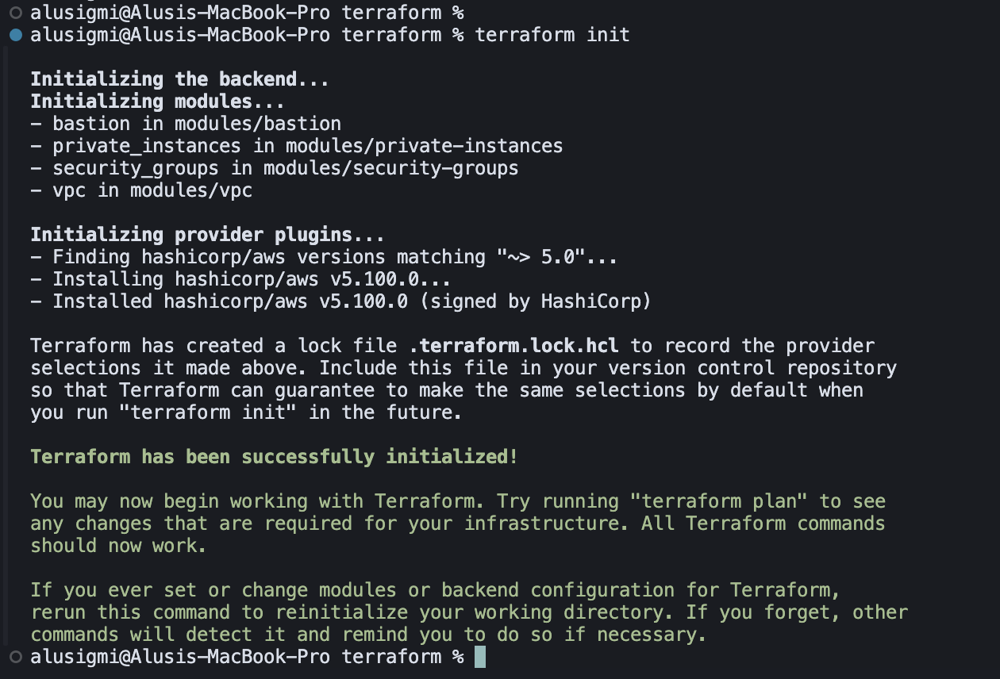

### Step 4 — Apply the infrastructure

```bash
terraform apply
```

Terraform shows the execution plan — all the resources it will create. Review the plan, then type `yes` to confirm:

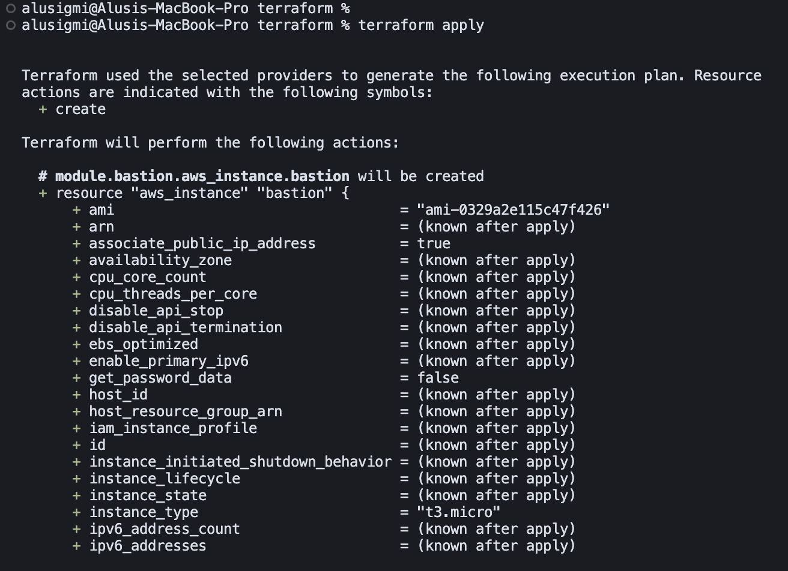

After ~2-3 minutes, all resources are created. Terraform outputs the bastion's public IP, all 6 private instance IPs, the monitoring private IP, and the VPC ID:

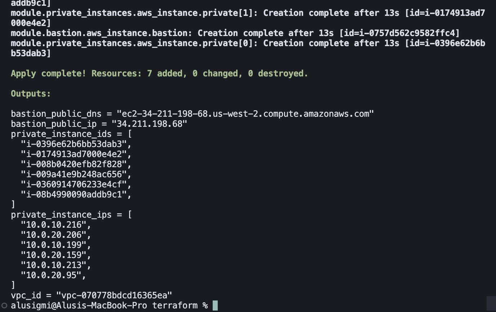

You can verify in the AWS Console that all **8 instances** are running (1 bastion + 6 private + 1 monitoring):

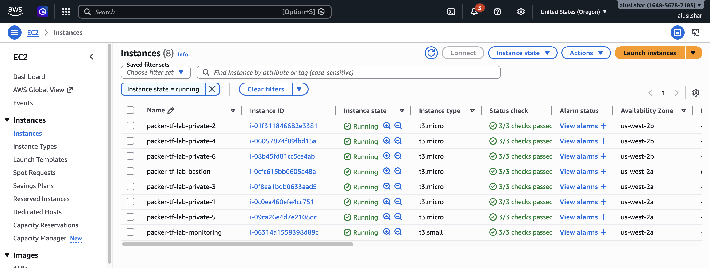

---

## Part C — Verify Connectivity

### Step 1 — SSH into the bastion host

Use the bastion public IP from the Terraform output:

```bash
ssh -i ~/.ssh/packer-tf-key.pem ec2-user@<bastion_public_ip>
```

You should see the Amazon Linux 2023 welcome banner:

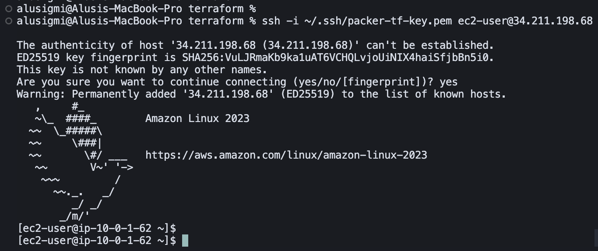

### Step 2 — From the bastion, SSH to a private instance

Pick any private IP from the Terraform output and connect from the bastion:

```bash
ssh ec2-user@<private_instance_ip>
```

Then verify Docker is installed and running:

```bash
docker --version
docker-compose version
```

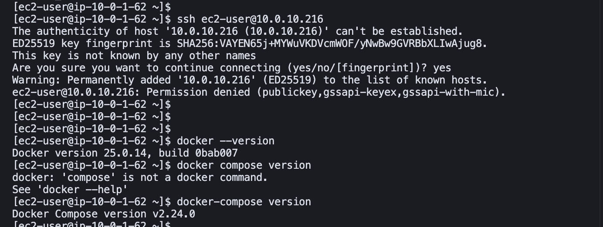

> **Tip:** You can also use SSH agent forwarding to connect in one step from your local machine:
> ```bash
> ssh-add ~/.ssh/packer-tf-key.pem
> ssh -A ec2-user@<bastion_public_ip>
> # then from the bastion:
> ssh ec2-user@<private_instance_ip>
> ```

---

## Part D — Verify Monitoring (Prometheus + Grafana)

### Step 1 — Create local tunnels through bastion to monitoring host

From your local machine, forward Prometheus and Grafana ports through the bastion:

```bash
ssh -i ~/.ssh/packer-tf-key.pem \
  -L 9090:<monitoring_private_ip>:9090 \
  -L 3000:<monitoring_private_ip>:3000 \
  ec2-user@<bastion_public_ip>
```

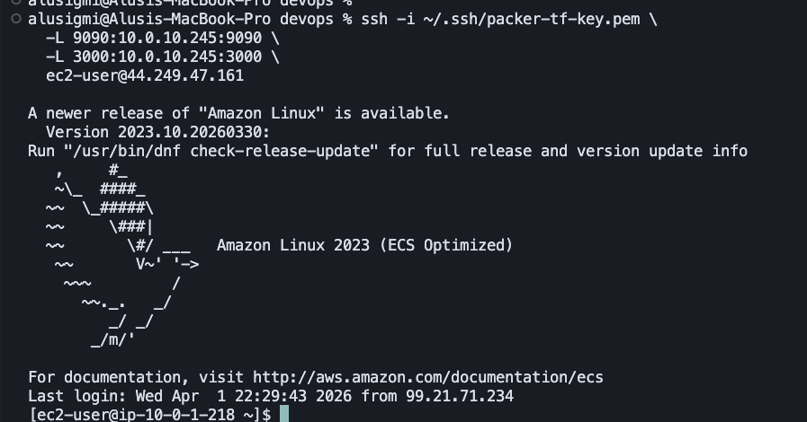

### Step 2 — Verify SSH hop from bastion to monitoring host

Use agent forwarding (or your preferred SSH method) and verify you can reach the monitoring instance from bastion:

```bash
ssh -A -i ~/.ssh/packer-tf-key.pem ec2-user@<bastion_public_ip>
ssh ec2-user@<monitoring_private_ip>
```

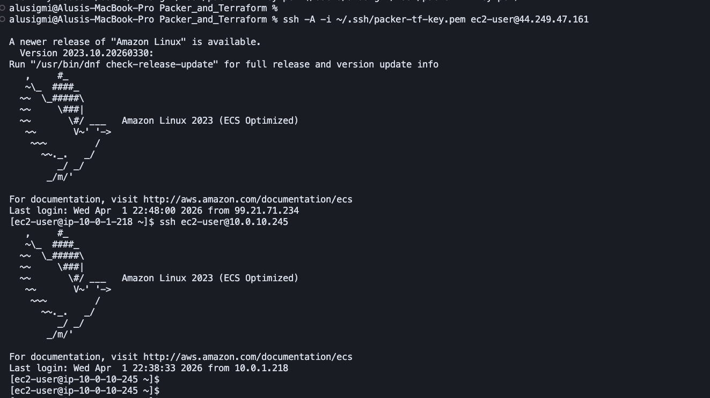

### Step 3 — Verify Prometheus/Grafana containers and health on monitoring host

```bash
cd /opt/monitoring
docker-compose ps
curl -s http://localhost:9090/-/healthy
curl -s http://localhost:3000/api/health
```

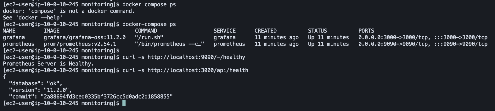

### Step 4 — Open the monitoring UIs locally

With the SSH tunnel active:

- Prometheus: `http://localhost:9090`
- Grafana: `http://localhost:3000`

Prometheus query page:

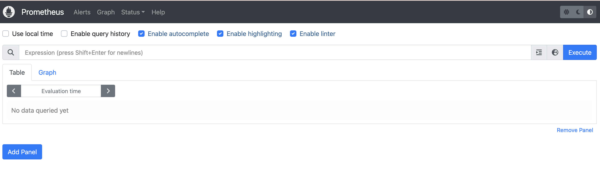

Grafana landing page after login:

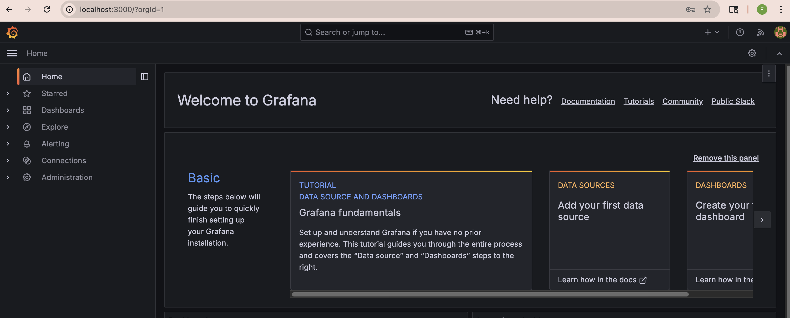

---

## What to Expect

After `terraform apply` completes successfully, you will have:

| Resource | Details |
|----------|---------|
| **VPC** | `10.0.0.0/16` with DNS support and DNS hostnames enabled |
| **Public subnets** | `10.0.1.0/24` (us-west-2a), `10.0.2.0/24` (us-west-2b) |
| **Private subnets** | `10.0.10.0/24` (us-west-2a), `10.0.20.0/24` (us-west-2b) |
| **Internet Gateway** | Attached to VPC, routed from public subnets |
| **NAT Gateway** | In the first public subnet with an Elastic IP, routed from private subnets |
| **Bastion host** | 1x `t3.micro` in the public subnet — SSH restricted to your IP only |
| **Private instances** | 6x `t3.micro` distributed across private subnets — SSH only from bastion |
| **Monitoring instance** | 1x private EC2 (default `t3.small`) running Prometheus (`9090`) and Grafana (`3000`) |

All 8 EC2 instances (1 bastion + 6 private + 1 monitoring) use the **custom Packer AMI** with Docker, Node Exporter, and your SSH key pre-installed.

### AWS Console Verification

**EC2 Instances** — All 8 instances running (1 bastion + 6 private + 1 monitoring)


**Security Groups** — Two security groups created by Terraform: `packer-tf-lab-bastion-sg` (allows SSH from your IP only) and `packer-tf-lab-private-sg` (allows SSH from the bastion SG only):

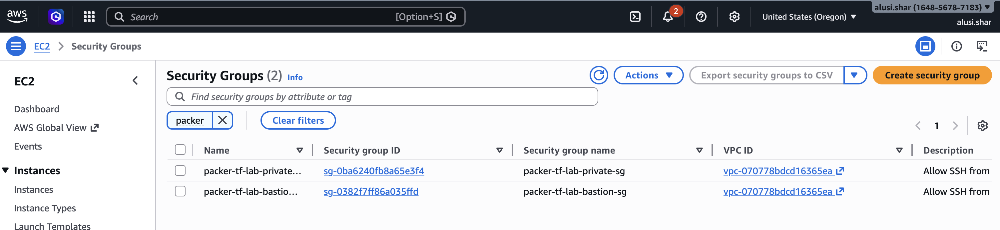

---

## Cleanup

To destroy all AWS resources and stop incurring charges:

```bash
cd terraform
terraform destroy
```

Type `yes` when prompted. This removes all 8 EC2 instances, the NAT Gateway, Elastic IP, subnets, route tables, security groups, Internet Gateway, and VPC.

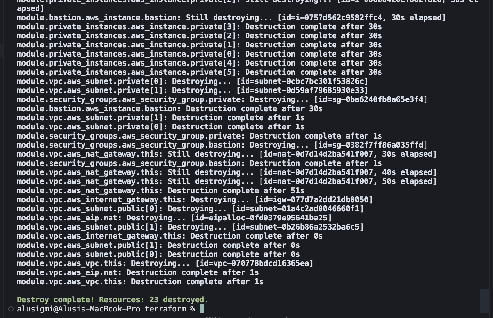

Optionally, deregister the Packer AMI and delete its snapshot:

```bash
aws ec2 deregister-image --image-id ami-0329a2e115c47f426 --region us-west-2
```
